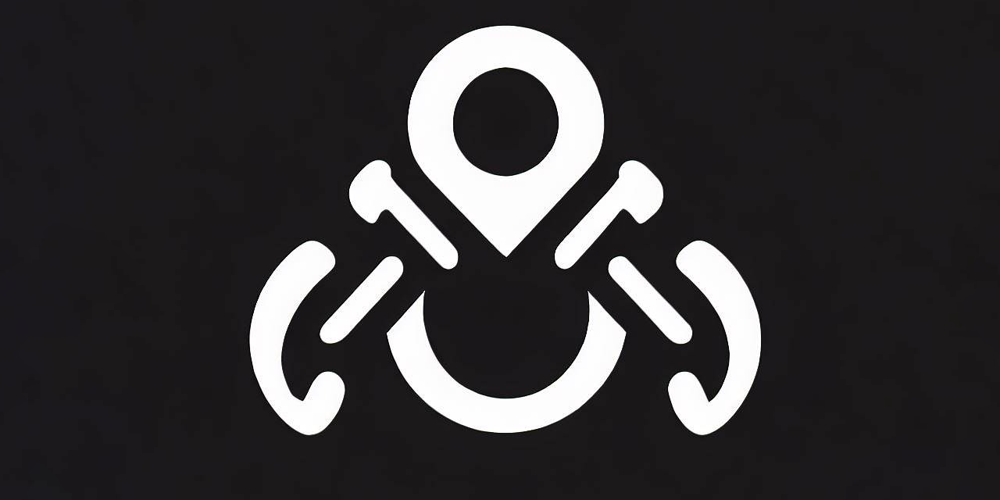
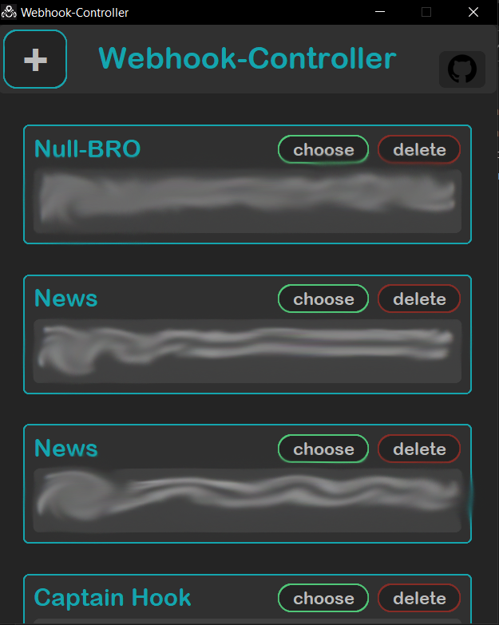
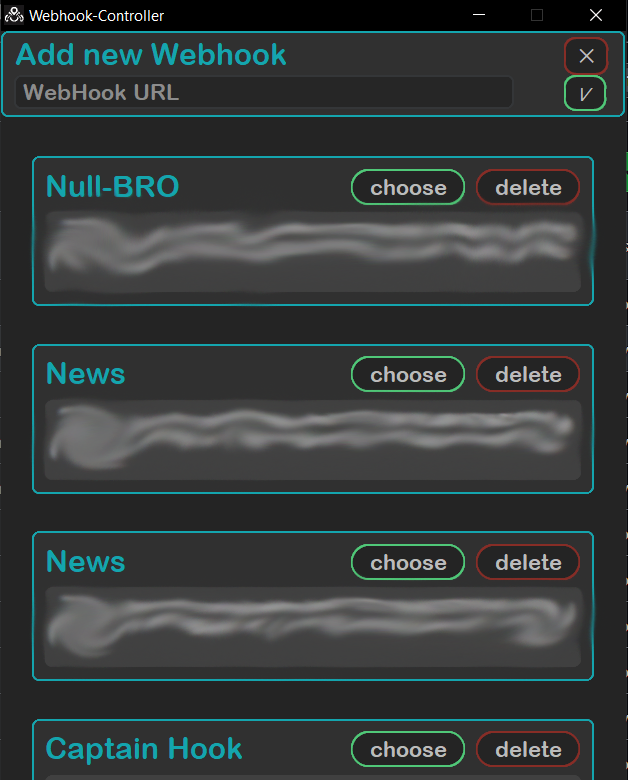
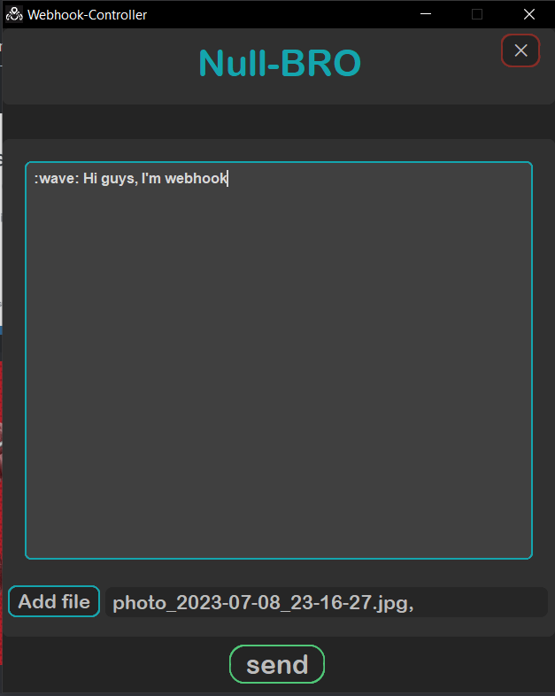
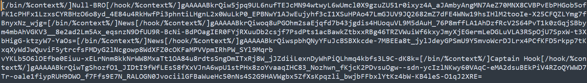
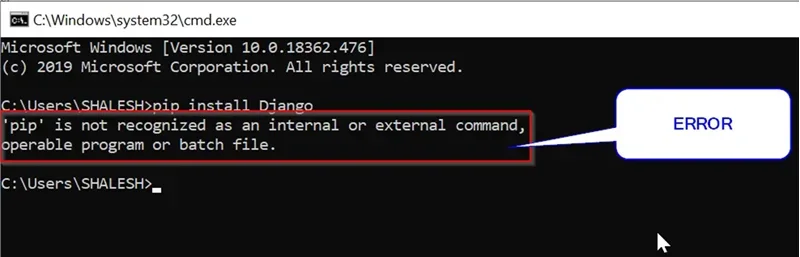

### Webhook-controller
🌐The prog for controlling discord webhooks written on python

---

### 🖼Overview

User-friendly interface in the form of a list(it can contain any number of webhooks)

Сonvenient addition of a webhook

Easily use or remove unwanted webhooks

fast work and sending

---

### 🔐Secure
All saved webhooks are stored locally encrypted with 2 keys and 3 ways

---

### 🧱Building

Install required modules `pip install -r requirements.txt`

Run `pack.bat` to pack .py scripts into exe

---
### ❌Builder errors

If you have error like this:

How to solve it read [here](https://www.stechies.com/pip-not-recognized-internal-external-command/)

---
[go up](#up)
